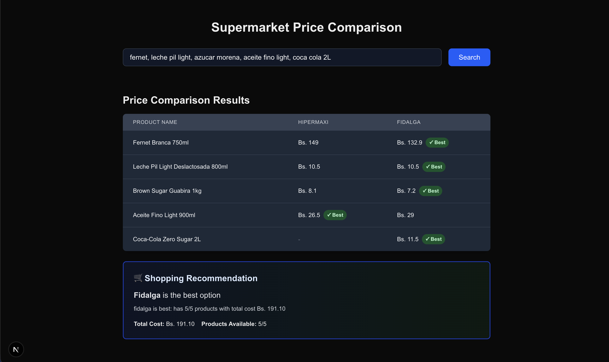

# 🛒 Supermarket Scraping Workflow

> **Course Project**: Build an AI-powered scraping workflow to compare supermarket prices.

[](https://youtu.be/H3DIE2L8UhE)

## 🚀 About The Project

This project is a practical example built for a YouTube course covering **Workflows**, **Web Scraping**, and the **AI SDK**. 

The application demonstrates how to orchestrate complex background tasks to compare product prices between two major supermarkets: **Fidalga** and **Hipermaxi**. By simply entering a products list, the system spins up a workflow that scrapes real-time data, processes the results, and presents the best options to the user.

## ✨ Key Features

- **⚡ Intelligent Workflows**: Orchestrates multiple scraping steps using the `Vercel Workflow` SDK.
- **🕸️ Multi-Source Scraping**: Fetches live product data from Fidalga and Hipermaxi simultaneously.
- **🧠 AI Integration**: Uses AI to process and normalize product data (as part of the course curriculum).
- **🔄 Real-time Feedback**: Streams workflow progress and results directly to the UI using Server-Sent Events (SSE) or similar streaming patterns.
- **🎨 Modern UI**: Built with **Next.js 16+** and **Tailwind CSS 4** for a sleek, responsive experience.

## 🛠️ Tech Stack

- **Framework**: [Next.js 16](https://nextjs.org/) (App Router)
- **Styling**: [Tailwind CSS 4](https://tailwindcss.com/)
- **Workflow Engine**: [Workflow Vercel SDK](https://useworkflow.dev/)
- **Language**: TypeScript

## 🚦 Getting Started

Follow these steps to set up the project locally.

### Prerequisites

Make sure you have [Node.js](https://nodejs.org/) installed on your machine.

### Installation

1. **Clone the repository**
   ```bash
   git clone https://github.com/your-username/workflow-ai-scraping.git
   cd workflow-ai-scraping
   ```

2. **Install dependencies**
   ```bash
   npm install
   # or
   pnpm install
   # or
   yarn install
   ```

3. **Run the development server**
   ```bash
   npm run dev
   ```

4. **Open your browser**
   Navigate to `http://localhost:3000` to see the app in action.

## 📚 Course Modules

This project covers the following concepts:

1.  **Workflows**: How to define, execute, and monitor durable background jobs.
2.  **Scraping**: Techniques for extracting data from modern web applications.
3.  **AI SDK**: integrating LLMs to make sense of unstructured scraped data.

---

*Built with ❤️ for the community.*
